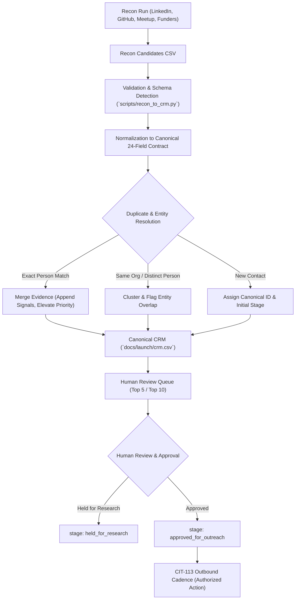

# Repeatable Recon-to-CRM Ingestion Pipeline (CIT-185)

> **Status:** APPROVED WORKFLOW & CANONICAL PIPELINE  
> **Linear Issues:** [CIT-185](https://linear.app/citizen6librarian6refrain4/issue/CIT-185/build-repeatable-recon-to-crm-ingestion-workflow) (Pipeline), [CIT-110](https://linear.app/citizen6librarian6refrain4/issue/CIT-110/build-prioritized-direct-connection-list-and-lightweight-crm) (Canonical CRM), [CIT-184](https://linear.app/citizen6librarian6refrain4/issue/CIT-184/run-linkedin-recon-with-playwright-mcp-using-reproducible-search) (LinkedIn Recon Fixture), [CIT-113](https://linear.app/citizen6librarian6refrain4/issue/CIT-113/run-personalized-outreach-and-meetup-follow-up-cadence) (Outreach Handoff).  
> **Strict Operational Guardrail:** Recon and ingestion **ONLY**. Absolutely no connection requests, messages, comments, applications, or outbound communications are authorized by this pipeline. Outbound action belongs strictly to **CIT-113** following human review and explicit authorization.

---

## 1. Executive Summary & Architecture

The recon-to-CRM pipeline establishes a reusable, deterministic mechanism for taking evidence-backed candidates from acquisition channels and merging them into the canonical CRM without data loss, manufactured familiarity, or duplicate contamination:



### Separation of Responsibilities
1. **Acquisition Runs ([CIT-184](https://linear.app/citizen6librarian6refrain4/issue/CIT-184/run-linkedin-recon-with-playwright-mcp-using-reproducible-search)-style issues):** Responsible for executing parameterized search queries across platforms (LinkedIn via Playwright-MCP, GitHub repos, AWS meetups, AI safety directories), discovering signals, and outputting evidence dossiers.
2. **Canonical CRM ([CIT-110](https://linear.app/citizen6librarian6refrain4/issue/CIT-110/build-prioritized-direct-connection-list-and-lightweight-crm) / `docs/launch/crm.csv`):** The single source of truth for all contact lifecycle states, research provenance, and priority ratings.
3. **Ingestion Engine ([CIT-185](https://linear.app/citizen6librarian6refrain4/issue/CIT-185/build-repeatable-recon-to-crm-ingestion-workflow) / `scripts/recon_to_crm.py`):** Deterministic Python CLI that validates incoming recon datasets, normalizes fields, performs deduplication, clusters organizations, updates the canonical CRM, and extracts review queues.
4. **Outreach & Delivery ([CIT-113](https://linear.app/citizen6librarian6refrain4/issue/CIT-113/run-personalized-outreach-and-meetup-follow-up-cadence)):** The only authorized issue and process for sending personalized messages, meetup introductions, and following up on replies.

---

## 2. Canonical CRM Data Contract (24 Fields)

The canonical CRM schema reconciles operational outreach tracking with deep research provenance. It enforces a strict separation between **verifiable observed evidence** and **inferred problem hypotheses**.

| # | Column Name | Type | Allowed Values / Format | Description & Purpose |
|---|---|---|---|---|
| 1 | `id` | Integer | `1`, `2`, `3`... | Sequential unique identifier across all contacts. |
| 2 | `person` | String | Full name | Full name of the candidate or contact. |
| 3 | `role_organisation` | String | Title and company | Current verified title and organization. |
| 4 | `profile_url` | String | URL or empty | Primary public profile URL (LinkedIn, GitHub, personal bio). |
| 5 | `source_query_method` | String | Text | Verifiable search query, meetup event, or acquisition channel. |
| 6 | `source_date` | String | `YYYY-MM-DD` or `YYYY-MM` | Date the public signal was published or observed. |
| 7 | `target_segment` | String | `Buyer`, `Adviser/Connector`, `Partner`, `practitioner`, `engineer`, `researcher`, `funder` | High-level segmentation for tailored messaging. |
| 8 | `engagement_role` | String | `buyer`, `adviser`, `connector`, `partner`, `practitioner`, `researcher`, `funder` | Operational engagement persona. |
| 9 | `observed_signal` | String | Verbatim quotes / factual citations | **Strictly verifiable factual evidence.** What the person actually wrote, presented, or built. No inference. |
| 10 | `primitive_relevance` | String | Technical text | Direct architectural mapping to the agent governance primitive (pre-merge gates, Pkl axioms, dual-ledger, reversibility). |
| 11 | `problem_hypothesis` | String | Inferred hypothesis | **Inferred friction or pain point.** Hypothesized operational friction the governance primitive solves. Kept strictly distinct from observed evidence. |
| 12 | `terminology_used` | String | Comma-separated phrases | Verbatim vocabulary used by the practitioner (*Planner-Authoriser Collision*, *Snapshot Discipline*, *Agent Tool Drift*, *NHI sprawl*). |
| 13 | `relationship_warm_intro` | String | Text | Real relationship status or warm path (meetup attendance, mutual connection, or substantive cold critique). Never manufacture familiarity. |
| 14 | `confidence` | Enum | `high`, `medium`, `low` | Confidence in profile validity and relevance to the primitive. |
| 15 | `review_priority` | Enum | `P1`, `P2`, `P3` | `P1`: High-signal immediate review queue.<br>`P2`: Qualified secondary candidate.<br>`P3`: Passive / backlog / held. |
| 16 | `priority_rationale` | String | Text | Concrete factual reason for the assigned priority level. |
| 17 | `stage` | Enum | `researched`, `review_queue`, `held_for_research`, `approved_for_outreach`, `contacted`, `in_dialogue`, `qualified`, `closed`, `opted_out` | Current pipeline lifecycle stage. All unreviewed high-priority intake starts at `review_queue`. |
| 18 | `last_contact` | String | `YYYY-MM-DD` or `None` | Date of last outbound or inbound interaction. Defaults to `None`. |
| 19 | `next_action_date` | String | Action and target deadline | Specific next research or outreach step with target date. |
| 20 | `reply_objection` | String | Text or `None` | Logged response, feedback, or objection. Defaults to `None`. |
| 21 | `contact_channel` | String | Channel name | Primary channel (`LinkedIn InMail`, `Meetup direct message`, `In-person meetup`, `Partner channel`, `Email`). |
| 22 | `workflow_owner` | String | Persona | Internal target decision-maker role (`Head of Security`, `CISO`, `CTO`, `Principal Architect`, `AI Safety Grantmaker`). |
| 23 | `commercial_fit` | String | Offer mapping | Strategic alignment (`Target for scoped assessment offer`, `Technical advisory / practitioner validation (CIT-181)`, `Grant funding candidate (CIT-179)`, `Strategic consulting partner`). |
| 24 | `declined_opt_out` | Enum | `No`, `Yes` | Opt-out flag. Immediate stop if `Yes`. |

---

## 3. Automation Tooling: `scripts/recon_to_crm.py`

The pipeline is implemented as an executable, deterministic Python utility with zero external dependencies (uses standard library `csv`, `re`, `argparse`, `os`).

### CLI Usage

```bash
# 1. Ingest incoming recon run into canonical CRM (Dry Run preview)
python3 scripts/recon_to_crm.py ingest \
  --recon docs/launch/linkedin-recon-candidates.csv \
  --crm docs/launch/crm.csv \
  --dry-run

# 2. Ingest and apply updates to canonical CRM
python3 scripts/recon_to_crm.py ingest \
  --recon docs/launch/linkedin-recon-candidates.csv \
  --crm docs/launch/crm.csv \
  --apply

# 3. Validate canonical CRM dataset against schema constraints
python3 scripts/recon_to_crm.py validate --file docs/launch/crm.csv

# 4. View Top 10 Human Review Queue
python3 scripts/recon_to_crm.py review-queue --crm docs/launch/crm.csv --limit 10

# 5. View Top 5 Human Review Queue
python3 scripts/recon_to_crm.py review-queue --crm docs/launch/crm.csv --limit 5

# 6. Generate comprehensive summary report
python3 scripts/recon_to_crm.py report --crm docs/launch/crm.csv
```

### Core Engine Capabilities
1. **Multi-Format Ingestion:** Auto-detects whether an input file is canonical CRM (24 fields), legacy CIT-110 CRM (17 fields), CIT-184 Recon CSV (15 fields), or generic recon output.
2. **Deduplication with Evidence Preservation:**
   - Evaluates normalized personal names (stripping honorifics like "Dr.", "Ph.D.", "CTO") and normalized profile URLs.
   - If an existing contact is encountered, the script **never drops data**. Instead, it merges the new observed signal into `observed_signal`, appends any new discovery queries into `source_query_method`, merges new terminology, and elevates review priority if incoming evidence is higher signal.
3. **Organization Clustering:**
   - Detects when multiple distinct individuals belong to the same entity (e.g. Canva, PolarSeven, Versent, Mantel Group, Redwood Research, Coefficient Giving, BlueDot Impact) and prints entity cluster warnings to prevent uncoordinated outreach.
4. **Stage-Weighted Review Queue:**
   - Prioritizes candidates with `stage == "review_queue"` and `review_priority == "P1"` before showing background `researched` records.
5. **Deterministic CSV Formatting:**
   - Enforces strict RFC 4180 compliance, preventing unquoted commas from corrupting downstream CSV readers.

---

## 4. CIT-184 Migration & Reconciliation Results

The existing CIT-184 recon run (`docs/launch/linkedin-recon-candidates.csv` and `docs/launch/linkedin-recon-report.md`) was used as the primary production test fixture to reconcile against the 20 CIT-110 seed records.

### Migration Summary
* **Prior CRM Records:** 20 (CIT-110 seed contacts)
* **Incoming Recon Records:** 30 (CIT-184 LinkedIn candidates)
* **Exact Duplicate People:** 0 (all 30 candidates are distinct individuals)
* **Newly Added Records:** 30
* **Final Canonical CRM Total:** 50 records in [`docs/launch/crm.csv`](file:///Users/rant/Desktop/agent-plugins/docs/launch/crm.csv)
* **Validation Status:** PASSED (100% compliant with Canonical 24-field contract)

### Organisation Clusters (Same Entity, Distinct People)
The ingestion engine detected 7 multi-contact organizational clusters across the dataset:
1. **Canva (2):** Matthew Hart (Head of Security) & Kane Narraway (Head of Enterprise Security).
2. **PolarSeven (2):** Daghan Acay (Lead Architect & Meetup Organizer) & Darrell King (Founder & CEO).
3. **Versent (2):** Aashish Jolly (Principal Solutions Architect & AWS Community Builder) & Tim Hope (CTO).
4. **Mantel Group / CMD Solutions (2):** Christina Chen (Senior Cloud Consultant) & Andre Morgan (Partner & CEO, CMD Solutions).
5. **Redwood Research (2):** Scott Wofford (AI Control SWE) & Buck Shlegeris (CEO).
6. **Coefficient Giving (2):** Max Nadeau (Program Officer) & Jake Mendel (Program Officer).
7. **BlueDot Impact (2):** Dewi Erwan (CEO) & Matthew Stults (Grantee / Researcher).

### Records Explicitly Held for Deeper Research (4)
Four candidates were identified as requiring additional qualification or monitoring before being queued for outreach, and were assigned `stage: held_for_research`:
* **Brian Peretti ([Retired] CTO & Deputy Chief AI Officer):** Retired government official; verify current active consulting availability before engaging.
* **Daniel Phillips (AI Safety Researcher):** Independent researcher; verify whether research covers software capability control vs pure alignment.
* **Mirco Bianchini (Sr TPM Automation & MCP):** Monitor upcoming MCP product announcements regarding enterprise access controls.
* **Tom McLeod (Global Advisor Internal Audit):** Global internal audit advisor; monitor for specific AI agent assurance frameworks.

### Schema Normalization & Fields Mapped
1. **CIT-110 Legacy CRM (17 fields):**
   - Composite `source_url_date` (e.g. `LinkedIn / Canva Tech Blog, 2026-05`) was cleanly separated into `source_query_method` and `source_date`.
   - `urgency` was mapped to canonical `review_priority` (`High` -> `P1`, `Medium` -> `P2`, `Low` -> `P3`).
   - Backfilled explicit `primitive_relevance` and `terminology_used` fields.
2. **CIT-184 Recon Schema (15 fields):**
   - Mapped `name` -> `person`, `signal_date` -> `source_date`, `public_signal` -> `observed_signal`, `terminology_notes` -> `terminology_used`.
   - Normalized unquoted commas in hypothesis fields into valid RFC 4180 format.
   - Assigned operational defaults (`last_contact: None`, `reply_objection: None`, `declined_opt_out: No`, `contact_channel: LinkedIn InMail`).

---

## 5. Resulting Top 10 Human Review Queue

The top 10 candidates generated by `scripts/recon_to_crm.py review-queue --limit 10`:

| # | ID | Candidate | Role & Organisation | Segment | Priority | Priority Rationale | Proposed Next Action |
|---|---|---|---|---|---|---|---|
| 1 | 21 | **Dr. Harish Kotadia Ph.D.** | Agentic AI Architect, Regulated Enterprises | practitioner | `P1` | Published analysis proving advisory policies fail and controls must mechanically stop actions before execution. | Review Edition 16 of Agentic AI Governance newsletter on agenticaiarch.com |
| 2 | 22 | **Ishmael Chibvuri** | Senior Security Architect, Enterprise Cloud & Zero Trust | practitioner | `P1` | Security architect; pioneered 'Snapshot Discipline' and reversibility as prerequisites for agent autonomy; validates restic snapshot model. | Review 'Snapshot Discipline' article and contrast with restic-backup snapshots |
| 3 | 23 | **Ofir Har-Chen** | Co-Founder & CEO at Clutch Security | practitioner | `P1` | CEO Clutch Security; quantified non-human identity sprawl (median 15 NHIs per agent, max 67k); proves credentials are agency. | Cross-reference Clutch Security's NHI findings against Proton Pass CLI credential acquisition model |
| 4 | 24 | **Inna Carp** | AI ERP & Business Analysis Lead, Dynamics 365 | practitioner | `P1` | Documented 'Agent Tool Drift' in Dynamics 365 ERP; proves prompts fail as security boundaries and validates typed capability checks. | Analyze her D365FO least-privilege agent pattern and compare with Pkl declared-vs-observed inventory |
| 5 | 26 | **Anurag Roy Barman** | Tech Area Architect (Digital IAM) at ANZ | practitioner | `P1` | Author of 'Planner-Authoriser Collision'; enterprise IAM architect at ANZ navigating APRA compliance for autonomous agents. | Read 'Why Your AI Agent Must Not Write Its Own Permissions' and map to supervisor protocol |
| 6 | 33 | **Jason Keirstead** | Founding CTO/CISO, Cybersecurity & AI Leader | researcher | `P1` | Founding CTO/CISO; advocates deterministic pre-merge invariants over soft runtime alignment. | Engage on his deterministic controls post with the TutorialKit 'bypassed gate' scenario |
| 7 | 41 | **Mandy Andress** | CISO at Elastic | Investor | Board Member | buyer | `P1` | CISO Elastic; established CISO requirements for identity-bound agent execution containment and least privilege. | Share our supervisor-grant / credential-revocation design |
| 8 | 45 | **Max Nadeau** | Program Officer (Technical AI Safety) at Coefficient | funder | `P1` | Program Officer at Coefficient Giving; directs grantmaking for technical AI safety and governance infrastructure (CIT-179 target). | Package initial grant proposal for CIT-179 tailored to Coefficient's technical AI safety priorities |
| 9 | 46 | **Jake Mendel** | Program Officer, Technical AI Safety at Coefficient Giving | funder | `P1` | Program Officer at Coefficient Giving; co-leads technical AI safety grant portfolio with Max Nadeau (CIT-179 target). | Submit structured 2-page grant brief once practitioner validation (CIT-181) is drafted |
| 10 | 47 | **Dewi Erwan** | Co-founder and CEO at BlueDot Impact | funder | `P1` | CEO BlueDot Impact; directs Rapid Grants program funding open-source technical AI safety infrastructure (CIT-179 target). | Prepare Rapid Grants application for hosting and demonstration costs (CIT-179) |

---

## 6. How Future Recon Runs Use This Workflow

Any future agent or human executing an acquisition run on another channel (e.g. GitHub stars/issues, Meetup registrations, AI safety conferences) must follow this procedure:

1. **Conduct Recon Run (Recon Only):**
   - Collect evidence-backed records into a CSV (minimum: person name, organization, public signal, discovery query/method, signal date).
   - Ensure observed signal is strictly separated from problem hypotheses.
2. **Execute Ingestion (Dry Run):**
   ```bash
   python3 scripts/recon_to_crm.py ingest --recon <new_recon_file.csv> --crm docs/launch/crm.csv --dry-run
   ```
   - Review deduplication yields, organization clusters, and priority assignments in the CLI output.
3. **Apply Ingestion:**
   ```bash
   python3 scripts/recon_to_crm.py ingest --recon <new_recon_file.csv> --crm docs/launch/crm.csv --apply
   ```
4. **Validate Dataset:**
   ```bash
   python3 scripts/recon_to_crm.py validate --file docs/launch/crm.csv
   ```
5. **Inspect Review Queue:**
   ```bash
   python3 scripts/recon_to_crm.py review-queue --crm docs/launch/crm.csv --limit 10
   ```
6. **Handoff to Human Review & CIT-113:**
   - Once a human reviewer moves records from `stage: review_queue` to `stage: approved_for_outreach`, the records are eligible for outbound engagement by **CIT-113**.
