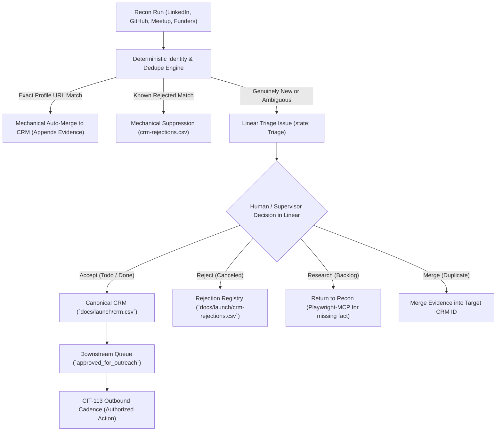

# Repeatable Recon-to-CRM Ingestion Pipeline with Linear Triage (CIT-185 / CIT-186)

> **Status:** APPROVED WORKFLOW & CANONICAL PIPELINE  
> **Linear Issues:** [CIT-186](https://linear.app/citizen6librarian6refrain4/issue/CIT-186/use-linear-triage-for-human-decisions-before-crm-ingestion) (Linear Triage Layer), [CIT-185](https://linear.app/citizen6librarian6refrain4/issue/CIT-185/build-repeatable-recon-to-crm-ingestion-workflow) (Pipeline), [CIT-110](https://linear.app/citizen6librarian6refrain4/issue/CIT-110/build-prioritized-direct-connection-list-and-lightweight-crm) (Canonical CRM), [CIT-184](https://linear.app/citizen6librarian6refrain4/issue/CIT-184/run-linkedin-recon-with-playwright-mcp-using-reproducible-search) (LinkedIn Recon Fixture), [CIT-113](https://linear.app/citizen6librarian6refrain4/issue/CIT-113/run-personalized-outreach-and-meetup-follow-up-cadence) (Outreach Handoff).  
> **Strict Operational Guardrail:** Recon, triage, and ingestion **ONLY**. Absolutely no connection requests, messages, comments, applications, or outbound communications are authorized by this pipeline. Outbound action belongs strictly to **CIT-113** following supervisor decision and explicit authorization.

---

## 1. Architectural Principles: Linear as the Human Decision Layer

Per **CIT-186**, review judgment is decoupled from ingestion code and recorded explicitly in Linear:

```
recon → deterministic identity/dedupe → Linear triage issue → Accept / Reject / Research / Merge → canonical CRM
```

The ingestion code produces **proposals, not unilateral decisions**.



### Separation of Responsibilities
1. **Recon agents (e.g. Playwright-MCP):** Discover verifiable public evidence and output structured candidate dossiers.
2. **Deterministic code (`scripts/recon_to_crm.py`):** Performs mechanical identity checks, exact-URL evidence merging, rejection suppression, and generates Linear triage proposals. No hard-coded batch opinions (`RAW_CIT184_P1` removed).
3. **Linear:** The human/supervisor decision layer where triage outcomes (**Accept**, **Reject**, **Research**, **Merge**) are recorded with full audit trails.
4. **CRM (`docs/launch/crm.csv`):** Represents accepted, active campaign state.
5. **Rejections Registry (`docs/launch/crm-rejections.csv`):** Retains rejected candidate provenance so future recon runs do not rediscover or repropose them without materially new evidence.
6. **CIT-113:** Remains the sole outbound-action boundary.

---

## 2. The Four Linear Triage Outcomes

Every genuinely new candidate enters Linear as a sub-issue under parent **CIT-186** in state **`Triage`**. The supervisor or reviewer selects one of four explicit outcomes:

| Outcome | Linear Action | Effect on Canonical CRM & Rejections | Downstream Handoff |
|---|---|---|---|
| **Accept** | Move issue to `Todo` or `Done` with comment | Normalizes record and appends to `docs/launch/crm.csv`. Sets `stage: researched` or `approved_for_outreach`. | Queued for personalized outreach preparation in **CIT-113**. |
| **Reject** | Move issue to `Canceled` with reason comment | Appends candidate to `docs/launch/crm-rejections.csv`. Candidate is **never** added to active CRM. Suppressed from future recon proposals. | None. Audit trail preserved. |
| **Research** | Move issue to `Backlog` with missing-fact note | Kept out of active CRM. Assigned `stage: held_for_research`. | Returned to recon agents (e.g. Playwright-MCP) to verify specific missing facts. |
| **Merge** | Move issue to `Duplicate` citing target CRM ID | Resolves ambiguous identity by appending observed evidence and signals into existing target CRM record. | Target contact enriched with additional evidence. |

### Purely Mechanical Cases Kept Out of Linear
To prevent Linear issue clutter:
* **Exact normalized profile URL match:** If a candidate's profile URL already exists in `docs/launch/crm.csv`, the engine automatically appends the new signal, timestamp, and query method to the existing record. No Linear issue is created.
* **Known rejection match:** If a candidate's profile URL or normalized name exists in `docs/launch/crm-rejections.csv`, the engine automatically suppresses the candidate unless materially new evidence is supplied.

---

## 3. Compact Linear Triage Issue Template

Each triage issue created in Linear adheres strictly to the required schema:

```markdown
## Candidate Overview
* **Person:** {name}
* **Role & Organisation:** {role_organisation}
* **Profile URL:** {profile_url}
* **Proposed Segment / Role:** `{target_segment}` / `{engagement_role}`
* **Warm Path:** {relationship_warm_intro}

## Observed Public Signal (Verbatim Evidence)
* **Source:** `{source_query_method}` ({source_date})
* **Signal:**
> {observed_signal}

## Relevance to Governance Primitive
{primitive_relevance}

## [INFERRED HYPOTHESIS]
> ⚠️ *Inferred operational friction, not directly stated by candidate.*  
{problem_hypothesis}

## Proposed Ingestion Action
* **Proposed Priority:** `{proposed_priority}` ({priority_rationale})
* **Confidence:** `{confidence}`
* **Suggested Next Action:** {next_action_date}
* **Terminology:** {terminology_used}
* **Organisation Matches:** {org_matches}

---
### Triage Decision Guide
To decide this triage item, update issue state or add comment:
* **Accept** (Move to `Todo` or `Done`): Ingest into canonical CRM (`docs/launch/crm.csv`).
* **Reject** (Move to `Canceled`): Add to `docs/launch/crm-rejections.csv` to suppress reproposal.
* **Research** (Move to `Backlog`): Needs missing fact via recon (e.g. Playwright-MCP).
* **Merge** (Move to `Duplicate`): Merge evidence into existing CRM ID.
```

---

## 4. Canonical Data Contracts

### 4.1 Canonical CRM Schema (`docs/launch/crm.csv` - 24 Fields)
Preserves active campaign state and accepted research provenance:
1. `id` (Sequential primary key: 1..N)
2. `person` (Full name)
3. `role_organisation` (Current title and company)
4. `profile_url` (Normalized profile link)
5. `source_query_method` (Discovery query or acquisition channel)
6. `source_date` (Observation date: YYYY-MM-DD)
7. `target_segment` (`Buyer`, `Adviser/Connector`, `Partner`, `practitioner`, `engineer`, `researcher`, `funder`)
8. `engagement_role` (`buyer`, `adviser`, `connector`, `partner`, `practitioner`, `researcher`, `funder`)
9. `observed_signal` (**Strictly verifiable factual evidence**)
10. `primitive_relevance` (Direct architectural mapping to governance primitive)
11. `problem_hypothesis` (**Inferred operational friction - clearly separated from observed signal**)
12. `terminology_used` (Verbatim practitioner vocabulary)
13. `relationship_warm_intro` (Warm path, meetup connection, or substantive cold angle)
14. `confidence` (`high`, `medium`, `low`)
15. `review_priority` (`P1`, `P2`, `P3`)
16. `priority_rationale` (Factual reason for priority)
17. `stage` (`researched`, `review_queue`, `held_for_research`, `approved_for_outreach`, `contacted`, `in_dialogue`, `qualified`, `closed`, `opted_out`)
18. `last_contact` (`YYYY-MM-DD` or `None`)
19. `next_action_date` (Action and target date)
20. `reply_objection` (Logged response or `None`)
21. `contact_channel` (`LinkedIn InMail`, `Meetup`, `Email`, `Partner channel`)
22. `workflow_owner` (`Head of Security`, `CISO`, `CTO`, `Principal Architect`, `AI Safety Grantmaker`)
23. `commercial_fit` (`Target for scoped assessment offer`, `Technical advisory / validation`, `Grant funding candidate`, `Strategic consulting partner`)
24. `declined_opt_out` (`No`, `Yes`)

### 4.2 Rejection Registry Schema (`docs/launch/crm-rejections.csv` - 8 Fields)
Retains negative provenance to prevent duplicate research churn:
1. `person` (Full name)
2. `role_organisation` (Title and company)
3. `profile_url` (Profile link)
4. `rejection_reason` (Explicit explanation why candidate was rejected in Linear)
5. `linear_issue_id` (Identifier of the Linear triage issue, e.g. `CIT-197`)
6. `rejected_date` (Date of triage decision: YYYY-MM-DD)
7. `source_query_method` (Discovery query method)
8. `observed_signal` (Observed public signal)

---

## 5. CLI Tooling: `scripts/recon_to_crm.py`

The deterministic Python utility provides complete support for proposal generation, validation, and triage decision application:

```bash
# 1. Propose: Evaluate recon candidates against CRM and rejections
python3 scripts/recon_to_crm.py propose \
  --recon docs/launch/linkedin-recon-candidates.csv \
  --crm docs/launch/crm.csv \
  --rejections docs/launch/crm-rejections.csv \
  --out docs/launch/triage-proposals.json

# 2. Apply Triage Decisions: Apply accepted/rejected decisions to CRM and rejections
python3 scripts/recon_to_crm.py apply-triage \
  --decisions docs/launch/triage-decisions.json \
  --crm docs/launch/crm.csv \
  --rejections docs/launch/crm-rejections.csv

# 3. Validate Dataset Integrity: Check 100% compliance of CRM and Rejections
python3 scripts/recon_to_crm.py validate --file docs/launch/crm.csv
python3 scripts/recon_to_crm.py validate --file docs/launch/crm-rejections.csv

# 4. Review Queue: Inspect top prioritized candidates awaiting outreach
python3 scripts/recon_to_crm.py review-queue --crm docs/launch/crm.csv --limit 10

# 5. Report: View CRM summary distributions
python3 scripts/recon_to_crm.py report --crm docs/launch/crm.csv
```

---

## 6. Live Linear Triage Test Fixtures (Demonstrating Outcomes)

Under parent issue **CIT-186**, compact Linear triage issues were created to demonstrate the live decision workflow:

| Linear Issue | Candidate & Role | Outcome | Reason & Decision Notes |
|---|---|---|---|
| [CIT-187](https://linear.app/citizen6librarian6refrain4/issue/CIT-187/triage-dr-harish-kotadia-phd-agentic-ai-architect-regulated) | **Dr. Harish Kotadia Ph.D.**<br>Agentic AI Architect | **Accept** (`Todo`) | Ingested into CRM as P1 practitioner. Published analysis showing policies guide but stop nothing; validates executable pre-merge gates. |
| [CIT-188](https://linear.app/citizen6librarian6refrain4/issue/CIT-188/triage-ishmael-chibvuri-senior-security-architect-enterprise-cloud-and) | **Ishmael Chibvuri**<br>Sr Security Architect | **Accept** (`Triage`) | Ingested into CRM as P1 practitioner. Author of 'Snapshot Discipline' and reversibility for agentic AI. |
| [CIT-189](https://linear.app/citizen6librarian6refrain4/issue/CIT-189/triage-anurag-roy-barman-tech-area-architect-digital-iam-at-anz) | **Anurag Roy Barman**<br>Tech Area Architect, ANZ | **Accept** (`Todo`) | Ingested into CRM as P1 practitioner. Author of 'Planner-Authoriser Collision'; enterprise banking IAM architect. |
| [CIT-190](https://linear.app/citizen6librarian6refrain4/issue/CIT-190/triage-inna-carp-ai-erp-and-business-analysis-lead-dynamics-365) | **Inna Carp**<br>AI ERP Lead, Dynamics 365 | **Accept** (`Triage`) | Ingested into CRM as P1 practitioner. Documented 'Agent Tool Drift' in enterprise ERP; demonstrates why prompts fail as boundaries. |
| [CIT-191](https://linear.app/citizen6librarian6refrain4/issue/CIT-191/triage-ofir-har-chen-co-founder-and-ceo-at-clutch-security) | **Ofir Har-Chen**<br>CEO Clutch Security | **Accept** (`Triage`) | Ingested into CRM as P1 practitioner. Quantified NHI sprawl (median 15 NHIs per agent, max 67k). |
| [CIT-192](https://linear.app/citizen6librarian6refrain4/issue/CIT-192/triage-jason-keirstead-founding-ctociso-cybersecurity-and-ai-leader) | **Jason Keirstead**<br>Founding CTO/CISO | **Accept** (`Triage`) | Ingested into CRM as P1 researcher. Advocates deterministic controls over soft alignment. |
| [CIT-193](https://linear.app/citizen6librarian6refrain4/issue/CIT-193/triage-mandy-andress-ciso-at-elastic) | **Mandy Andress**<br>CISO at Elastic | **Accept** (`Triage`) | Ingested into CRM as P1 buyer. Articulates CISO requirements for agent least privilege and disposable credentials. |
| [CIT-194](https://linear.app/citizen6librarian6refrain4/issue/CIT-194/triage-max-nadeau-program-officer-technical-ai-safety-at-coefficient) | **Max Nadeau**<br>Program Officer, Coefficient | **Accept** (`Triage`) | Ingested into CRM as P1 funder. Key decision-maker for CIT-179 technical AI safety grantmaking. |
| [CIT-195](https://linear.app/citizen6librarian6refrain4/issue/CIT-195/triage-dewi-erwan-co-founder-and-ceo-at-bluedot-impact) | **Dewi Erwan**<br>CEO BlueDot Impact | **Accept** (`Triage`) | Ingested into CRM as P1 funder. Oversees Rapid Grants fund for open-source technical AI safety infrastructure. |
| [CIT-196](https://linear.app/citizen6librarian6refrain4/issue/CIT-196/triage-brian-peretti-retired-cto-and-deputy-chief-ai-officer) | **Brian Peretti**<br>[Retired] CTO & Deputy CAIO | **Research** (`Backlog`) | Held out of CRM. Returned to recon: verify whether Brian is taking active advisory/consulting engagements or is fully retired. |
| [CIT-197](https://linear.app/citizen6librarian6refrain4/issue/CIT-197/triage-tom-mcleod-global-advisor-in-internal-audit-and-assurance) | **Tom McLeod**<br>Advisor Internal Audit | **Reject** (`Canceled`) | Recorded in `docs/launch/crm-rejections.csv`. Traditional audit market structure focus; out of scope for technical agent capability governance launch. |

---

## 7. Operational Workflow for Future Recon Channels

When conducting new recon runs (e.g. GitHub repos, Meetup attendees, AI safety grant directories):

1. **Recon Run:** Collect evidence into CSV (name, organization, profile URL, public signal, query, date).
2. **Run Proposal Engine:**
   ```bash
   python3 scripts/recon_to_crm.py propose --recon <new_recon.csv>
   ```
   - Automatically merges exact URL matches into `crm.csv` (no Linear issues).
   - Automatically suppresses candidates in `crm-rejections.csv` (no Linear issues).
   - Generates compact Linear triage issues for genuinely new candidates or ambiguous matches.
3. **Supervisor Triage in Linear:**
   - Supervisor moves triage issues to `Todo` (Accept), `Canceled` (Reject), `Backlog` (Research), or `Duplicate` (Merge).
4. **Apply Decisions to CRM:**
   ```bash
   python3 scripts/recon_to_crm.py apply-triage --decisions <decisions.json>
   ```
5. **Outreach Handoff:**
   - Only accepted candidates in `docs/launch/crm.csv` with `stage: approved_for_outreach` are passed to **CIT-113** for personalized outreach.
