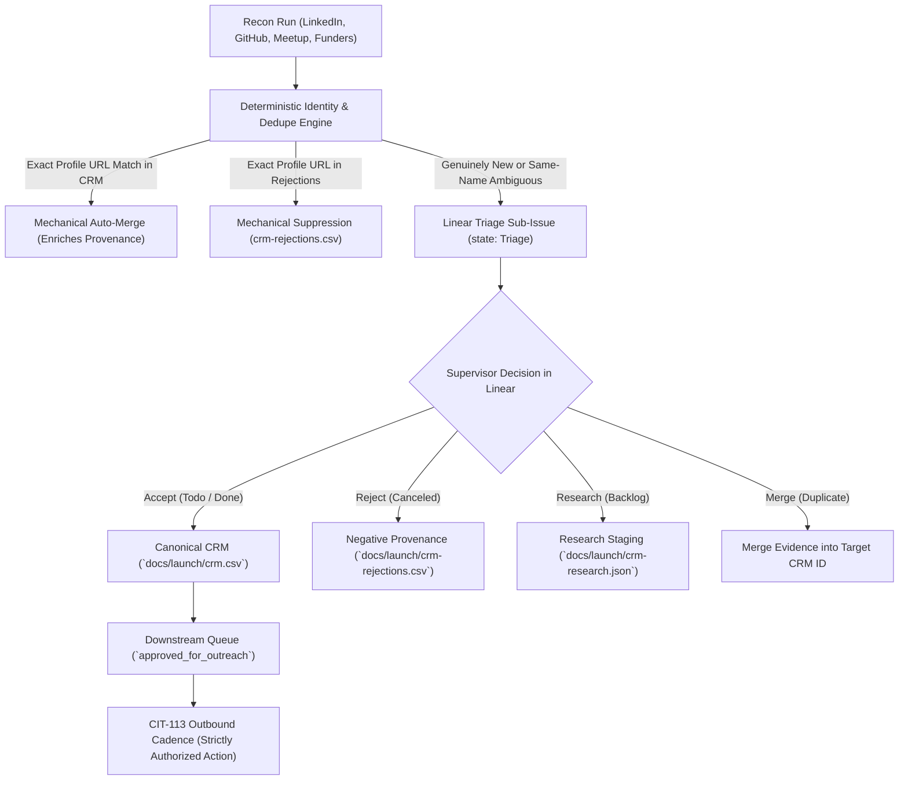

# Repeatable Recon-to-CRM Ingestion Pipeline with Linear Triage (CIT-185 / CIT-186 / CIT-198)

> **Status:** APPROVED WORKFLOW & CANONICAL PIPELINE  
> **Linear Issues:** [CIT-198](https://linear.app/citizen6librarian6refrain4/issue/CIT-198/make-linear-authoritative-before-crm-ingestion) (Linear Authority & Invariants), [CIT-186](https://linear.app/citizen6librarian6refrain4/issue/CIT-186/use-linear-triage-for-human-decisions-before-crm-ingestion) (Linear Triage Layer), [CIT-185](https://linear.app/citizen6librarian6refrain4/issue/CIT-185/build-repeatable-recon-to-crm-ingestion-workflow) (Pipeline), [CIT-110](https://linear.app/citizen6librarian6refrain4/issue/CIT-110/build-prioritized-direct-connection-list-and-lightweight-crm) (Canonical CRM), [CIT-184](https://linear.app/citizen6librarian6refrain4/issue/CIT-184/run-linkedin-recon-with-playwright-mcp-using-reproducible-search) (LinkedIn Recon Fixture), [CIT-113](https://linear.app/citizen6librarian6refrain4/issue/CIT-113/run-personalized-outreach-and-meetup-follow-up-cadence) (Outreach Handoff).  
> **Strict Operational Guardrail:** Recon, triage, and ingestion **ONLY**. Absolutely no connection requests, messages, comments, applications, or outbound communications are authorized by this pipeline. Outbound action belongs strictly to **CIT-113** following supervisor decision and explicit authorization.

---

## 1. Architectural Invariants: Linear as the Authoritative Gate (CIT-198)

Per **CIT-198**, the Linear gate is authoritative in machine state, not just descriptive. The architecture is bound by two fundamental invariants:

> **Invariant 1:** Every non-grandfathered CRM record must have an explicit `Accept` decision in Linear, and every `Accept` decision must correspond to exactly one CRM identity.
>
> **Invariant 2:** No `Triage` (unresolved), `Research` (`Backlog`), `Reject` (`Canceled`), or unresolved `Merge` (`Duplicate`) decision may create an independent CRM record.

```
recon facts → deterministic identity check → Linear proposal → human decision → accepted state mutation
```

The ingestion code produces **proposals, not decisions**. A fabricated or stale local JSON decision cannot override Linear authority.



### Separation of Responsibilities & Mutation Boundaries
1. **Recon agents (e.g. Playwright-MCP):** Discover verifiable public evidence and output structured candidate dossiers.
2. **Deterministic code (`scripts/recon_to_crm.py`):**
   - Exact normalized profile URL match: auto-merges evidence to existing CRM contact.
   - Same-name-only matches: **never** auto-merged or suppressed; routed to ambiguous triage.
   - Rejection registry: suppresses known rejected profiles by exact URL.
   - Direct ingestion bypass: blocked. `ingest` cannot create new identities without a Linear decision.
3. **Linear (`docs/launch/linear-triage-state.json`):** Authoritative state machine. Only `Todo` or `Done` status authorizes CRM identity creation.
4. **Canonical CRM (`docs/launch/crm.csv`):** 22 contacts (20 grandfathered CIT-110 contacts + 2 accepted CIT-187/CIT-189 contacts). Zero unresolved triage or research leads.
5. **Research Staging (`docs/launch/crm-research.json`):** Candidates awaiting missing facts remain strictly outside canonical CRM.
6. **Rejection Provenance (`docs/launch/crm-rejections.csv`):** Retains negative provenance to suppress duplicate research churn across campaigns.
7. **CIT-113:** Sole outbound-action boundary.

---

## 2. The Four Authoritative Triage Outcomes

Every genuinely new candidate enters Linear as a sub-issue under parent **CIT-186** in state **`Triage`**. The supervisor or reviewer selects one of four explicit outcomes:

| Outcome | Authoritative Linear State | Effect on Canonical CRM & Registries | Downstream Handoff |
|---|---|---|---|
| **Accept** | `Todo` or `Done` | Creates exactly one canonical CRM record in `docs/launch/crm.csv`. Rerunning is idempotent. | Queued for personalized outreach preparation in **CIT-113**. |
| **Reject** | `Canceled` | Appends candidate to `docs/launch/crm-rejections.csv`. Candidate is removed if present in CRM and suppressed from future recon. | None. Audit trail preserved. |
| **Research** | `Backlog` | Staged outside CRM in `docs/launch/crm-research.json`. **Never** creates an active CRM identity. | Returned to recon agents (Playwright-MCP) to verify specific missing facts. |
| **Merge** | `Duplicate` citing target ID | Resolves ambiguous identity by appending evidence into existing target CRM record without creating a new record. | Target contact enriched with additional evidence. |

### Strict Mechanical Boundaries
To guarantee safety and prevent identity collision:
* **Exact normalized profile URL match:** Purely mechanical enrichment; appends new evidence to existing CRM contact.
* **Same-name-only matches:** Never auto-merged and never auto-suppressed. Flagged as `⚠️ Ambiguous Name Match` and routed to human triage.
* **Known rejection match:** If an incoming candidate's profile URL matches `crm-rejections.csv`, it is suppressed mechanically.

---

## 3. Compact Linear Triage Issue Template

Each triage issue created in Linear adheres strictly to the required schema:

```markdown
## Candidate Overview
* **Person:** {name}
* **Role & Organisation:** {role_organisation}
* **Profile URL:** {profile_url}
* **Proposed Segment / Role:** `{target_segment}` / `{engagement_role}`
* **Warm Path:** {relationship_warm_intro}

## Observed Public Signal (Verbatim Evidence)
* **Source:** `{source_query_method}` ({source_date})
* **Signal:**
> {observed_signal}

## Relevance to Governance Primitive
{primitive_relevance}

## [INFERRED HYPOTHESIS]
> ⚠️ *Inferred operational friction, not directly stated by candidate.*  
{problem_hypothesis}

## Proposed Ingestion Action
* **Proposed Priority:** `{proposed_priority}` ({priority_rationale})
* **Confidence:** `{confidence}`
* **Suggested Next Action:** {next_action_date}
* **Terminology:** {terminology_used}
* **Organisation Matches:** {org_matches}

---
### Triage Decision Guide
To decide this triage item, update issue state or add comment:
* **Accept** (Move to `Todo` or `Done`): Ingest into canonical CRM (`docs/launch/crm.csv`).
* **Reject** (Move to `Canceled`): Add to `docs/launch/crm-rejections.csv` to suppress reproposal.
* **Research** (Move to `Backlog`): Needs missing fact via recon (e.g. Playwright-MCP).
* **Merge** (Move to `Duplicate`): Merge evidence into existing CRM ID.
```

---

## 4. Canonical Data Contracts

### 4.1 Canonical CRM Schema (`docs/launch/crm.csv` - 24 Fields)
Preserves active campaign state and accepted research provenance:
1. `id` (Sequential primary key: 1..N)
2. `person` (Full name)
3. `role_organisation` (Current title and company)
4. `profile_url` (Normalized profile link)
5. `source_query_method` (Discovery query or acquisition channel)
6. `source_date` (Observation date: YYYY-MM-DD)
7. `target_segment` (`Buyer`, `Adviser/Connector`, `Partner`, `practitioner`, `engineer`, `researcher`, `funder`)
8. `engagement_role` (`buyer`, `adviser`, `connector`, `partner`, `practitioner`, `researcher`, `funder`)
9. `observed_signal` (**Strictly verifiable factual evidence**)
10. `primitive_relevance` (Direct architectural mapping to governance primitive)
11. `problem_hypothesis` (**Inferred operational friction - clearly separated from observed signal**)
12. `terminology_used` (Verbatim practitioner vocabulary)
13. `relationship_warm_intro` (Warm path, meetup connection, or substantive cold angle)
14. `confidence` (`high`, `medium`, `low`)
15. `review_priority` (`P1`, `P2`, `P3`)
16. `priority_rationale` (Factual reason for priority)
17. `stage` (`researched`, `review_queue`, `held_for_research`, `approved_for_outreach`, `contacted`, `in_dialogue`, `qualified`, `closed`, `opted_out`)
18. `last_contact` (`YYYY-MM-DD` or `None`)
19. `next_action_date` (Action and target date)
20. `reply_objection` (Logged response or `None`)
21. `contact_channel` (`LinkedIn InMail`, `Meetup`, `Email`, `Partner channel`)
22. `workflow_owner` (`Head of Security`, `CISO`, `CTO`, `Principal Architect`, `AI Safety Grantmaker`)
23. `commercial_fit` (`Target for scoped assessment offer`, `Technical advisory / validation`, `Grant funding candidate`, `Strategic consulting partner`)
24. `declined_opt_out` (`No`, `Yes`)

### 4.2 Rejection Registry Schema (`docs/launch/crm-rejections.csv` - 8 Fields)
Retains negative provenance to prevent duplicate research churn:
1. `person` (Full name)
2. `role_organisation` (Title and company)
3. `profile_url` (Profile link)
4. `rejection_reason` (Explicit explanation why candidate was rejected in Linear)
5. `linear_issue_id` (Identifier of the Linear triage issue, e.g. `CIT-197`)
6. `rejected_date` (Date of triage decision: YYYY-MM-DD)
7. `source_query_method` (Discovery query method)
8. `observed_signal` (Observed public signal)

---

## 5. CLI Tooling: `scripts/recon_to_crm.py`

The deterministic Python utility provides complete support for proposal generation, Linear authority synchronization, invariant validation, and decision application:

```bash
# 1. Propose: Evaluate recon candidates and persist mechanical URL enrichments
python3 scripts/recon_to_crm.py propose \
  --recon docs/launch/linkedin-recon-candidates.csv \
  --crm docs/launch/crm.csv \
  --rejections docs/launch/crm-rejections.csv \
  --out docs/launch/triage-proposals.json

# 2. Validate Linear Authority Invariants (CIT-198)
python3 scripts/recon_to_crm.py validate-invariants \
  --crm docs/launch/crm.csv \
  --linear-state docs/launch/linear-triage-state.json \
  --rejections docs/launch/crm-rejections.csv

# 3. Apply Triage Decisions directly from Linear Authority
python3 scripts/recon_to_crm.py apply-triage \
  --from-linear \
  --linear-state docs/launch/linear-triage-state.json \
  --crm docs/launch/crm.csv \
  --rejections docs/launch/crm-rejections.csv \
  --research docs/launch/crm-research.json \
  --proposals docs/launch/triage-proposals.json

# 4. Ingest (Mechanical enrichment ONLY; direct bypass blocked)
python3 scripts/recon_to_crm.py ingest \
  --recon docs/launch/linkedin-recon-candidates.csv \
  --crm docs/launch/crm.csv \
  --apply

# 5. Validate Canonical CSV Schema
python3 scripts/recon_to_crm.py validate --file docs/launch/crm.csv
python3 scripts/recon_to_crm.py validate --file docs/launch/crm-rejections.csv

# 6. Review Queue: Top prioritized candidates awaiting outreach approval
python3 scripts/recon_to_crm.py review-queue --crm docs/launch/crm.csv --limit 10

# 7. Report: View CRM distributions
python3 scripts/recon_to_crm.py report --crm docs/launch/crm.csv
```

---

## 6. Authoritative Linear Triage Fixtures & Current State

Under parent issue **CIT-186**, Linear triage issues demonstrate the live decision workflow:

| Linear Issue | Candidate & Role | Linear Status | Triage Outcome | CRM State | Decision Rationale & Next Steps |
|---|---|---|---|---|---|
| [CIT-187](https://linear.app/citizen6librarian6refrain4/issue/CIT-187/triage-dr-harish-kotadia-phd-agentic-ai-architect-regulated) | **Dr. Harish Kotadia Ph.D.**<br>Agentic AI Architect | `Todo` | **Accept** | Ingested (CRM ID 21) | Published analysis proving advisory policies fail and controls must halt actions mechanically. |
| [CIT-189](https://linear.app/citizen6librarian6refrain4/issue/CIT-189/triage-anurag-roy-barman-tech-area-architect-digital-iam-at-anz) | **Anurag Roy Barman**<br>Tech Area Architect, ANZ | `Todo` | **Accept** | Ingested (CRM ID 22) | Author of 'Planner-Authoriser Collision'; enterprise banking IAM architect. |
| [CIT-196](https://linear.app/citizen6librarian6refrain4/issue/CIT-196/triage-brian-peretti-retired-cto-and-deputy-chief-ai-officer) | **Brian Peretti**<br>[Retired] CTO & Deputy CAIO | `Backlog` | **Research** | Staged in `crm-research.json` (**Absent from CRM**) | Verify active consulting availability before direct contact. |
| [CIT-197](https://linear.app/citizen6librarian6refrain4/issue/CIT-197/triage-tom-mcleod-global-advisor-in-internal-audit-and-assurance) | **Tom McLeod**<br>Advisor Internal Audit | `Canceled` | **Reject** | Recorded in `crm-rejections.csv` (**Absent from CRM**) | Traditional audit focus out of scope for agent capability controls launch. |
| [CIT-188](https://linear.app/citizen6librarian6refrain4/issue/CIT-188/triage-ishmael-chibvuri-senior-security-architect-enterprise-cloud-and) | **Ishmael Chibvuri**<br>Sr Security Architect | `Triage` | *Pending* | **Absent from CRM** | Awaiting supervisor triage decision. |
| [CIT-190](https://linear.app/citizen6librarian6refrain4/issue/CIT-190/triage-inna-carp-ai-erp-and-business-analysis-lead-dynamics-365) | **Inna Carp**<br>AI ERP Lead | `Triage` | *Pending* | **Absent from CRM** | Awaiting supervisor triage decision. |
| [CIT-191](https://linear.app/citizen6librarian6refrain4/issue/CIT-191/triage-ofir-har-chen-co-founder-and-ceo-at-clutch-security) | **Ofir Har-Chen**<br>CEO Clutch Security | `Triage` | *Pending* | **Absent from CRM** | Awaiting supervisor triage decision. |
| [CIT-192](https://linear.app/citizen6librarian6refrain4/issue/CIT-192/triage-jason-keirstead-founding-ctociso-cybersecurity-and-ai-leader) | **Jason Keirstead**<br>Founding CTO/CISO | `Triage` | *Pending* | **Absent from CRM** | Awaiting supervisor triage decision. |
| [CIT-193](https://linear.app/citizen6librarian6refrain4/issue/CIT-193/triage-mandy-andress-ciso-at-elastic) | **Mandy Andress**<br>CISO at Elastic | `Triage` | *Pending* | **Absent from CRM** | Awaiting supervisor triage decision. |
| [CIT-194](https://linear.app/citizen6librarian6refrain4/issue/CIT-194/triage-max-nadeau-program-officer-technical-ai-safety-at-coefficient) | **Max Nadeau**<br>Program Officer, Coefficient | `Triage` | *Pending* | **Absent from CRM** | Awaiting supervisor triage decision. |
| [CIT-195](https://linear.app/citizen6librarian6refrain4/issue/CIT-195/triage-dewi-erwan-co-founder-and-ceo-at-bluedot-impact) | **Dewi Erwan**<br>CEO BlueDot Impact | `Triage` | *Pending* | **Absent from CRM** | Awaiting supervisor triage decision. |

---

## 7. Operational Workflow for Future Recon Channels

When conducting new recon runs (e.g. GitHub repos, Meetup attendees, AI safety grant directories):

1. **Recon Run:** Collect evidence into CSV (name, organization, profile URL, public signal, query, date).
2. **Run Proposal Engine:**
   ```bash
   python3 scripts/recon_to_crm.py propose --recon <new_recon.csv>
   ```
   - Automatically enriches existing CRM contacts by exact normalized URL.
   - Automatically suppresses candidates in `crm-rejections.csv` by exact normalized URL.
   - Generates compact Linear triage issues for genuinely new candidates or ambiguous matches.
3. **Supervisor Triage in Linear:**
   - Supervisor reviews triage issues in Linear and moves them to `Todo` (Accept), `Canceled` (Reject), `Backlog` (Research), or `Duplicate` (Merge).
4. **Apply Verified Decisions:**
   ```bash
   python3 scripts/recon_to_crm.py apply-triage --from-linear
   ```
5. **Verify Invariants:**
   ```bash
   python3 scripts/recon_to_crm.py validate-invariants
   ```
6. **Outreach Handoff:**
   - Only accepted candidates in `docs/launch/crm.csv` with `stage: approved_for_outreach` are passed to **CIT-113** for personalized outreach.
