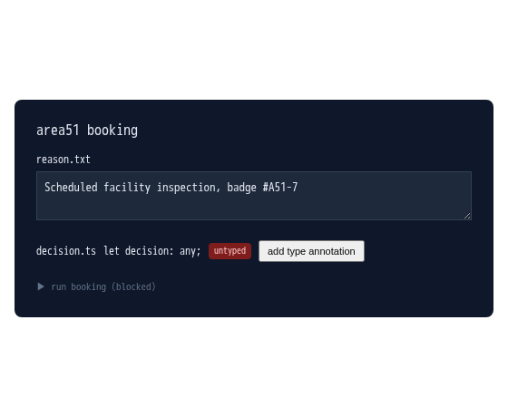

`reason.txt` starts empty, so the check under it reads it as not compiling -- the red squiggle is that check failing, live. Type a real reason (ten characters or more) and the squiggle clears: the check re-runs on every keystroke, not just on submit.

