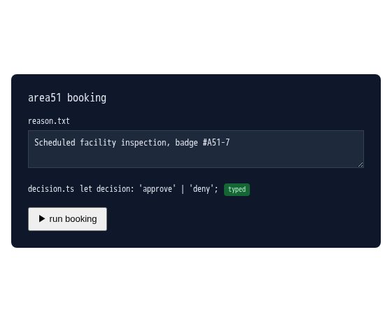

`decision.ts` starts as `let decision: any;` -- untyped, so nothing here stops a bad value from reaching `run booking` downstream. Add the type annotation and the badge flips: the line now reads `'approve' | 'deny'` instead of `any`. (This demo only displays the annotation; nothing here type-checks it.)

